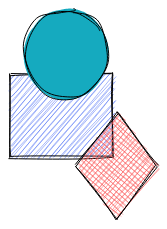

Bilder werden mit ``-Tags eingebunden. `img` ist ein leeres Element. Das eingebundene Bild wird mit Hilfe des `src`-Attributs referenziert (_source_),
d.h. dass das `src`-Attribut z.B. eine URL für ein beliebiges Bild im Web
oder ein Dateipfad für ein Bild im lokalen Dateisystem bzw. auf dem gleichen Server wie die Webseite
enthält.

Zusätzlich zu `src` sollte ein Attribut `alt` angegeben werden, das
eine Beschreibung des Bilds enthält (`alt` steht für „_alternative text_“). Dadurch
hat das Bild eine Beschreibung, falls das Bild nicht geladen werden kann
oder jemand auf die Beschreibung angewiesen ist (z.B. bei _screen reader_
Programmen, die die Webseite automatisch in gesprochene Sprache umwandeln).

```html

```

Die URL in dem Beispiel dient nur zur Veranschaulichung &mdash;
das durch `src` referenzierte Bild würde dann an der Stelle des `img`-Elements im Browser
angezeigt:


