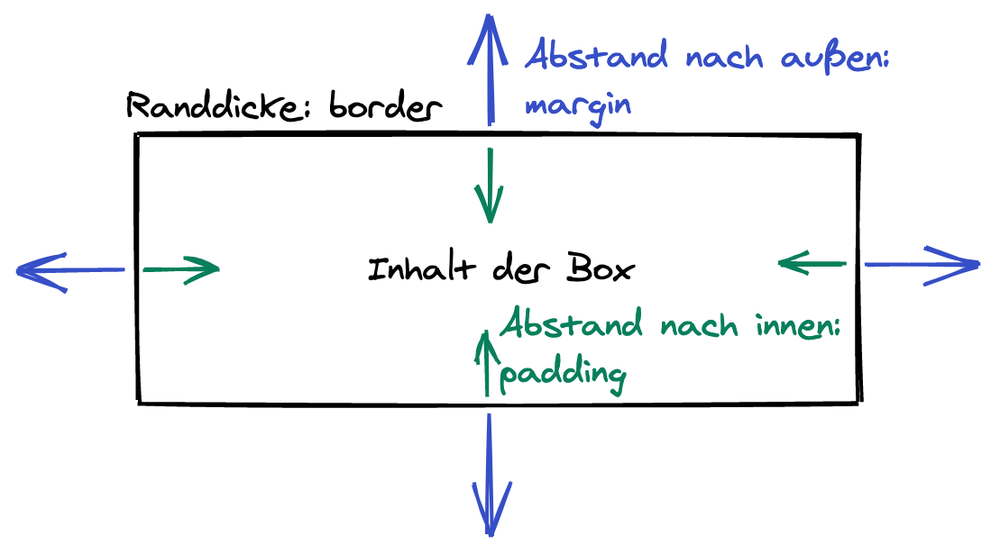

import WebPlayground from '../../components/WebPlayground'

Aus CSS-Sicht sind alle HTML-Elemente rechteckige „Boxen“ mit Rändern und
Abständen nach außen und innen. Für die Ränder aller vier Seiten der Box
kann die Dicke, Strichart und Farbe bestimmt werden.
Ebenso können an allen vier Seiten der Box
Abstände nach außen und nach innen festgelegt werden. Die Außenabstände
werden durch die Eigenschaft `margin` bestimmt, die Innenabstände durch
`padding` und die Ränder durch verschiedene `border`-Eigenschaften.
Dieses Konzept wird in CSS „_box model_“ genannt.



### Rand

Die Dicke des Randes wird mit `border-width` festgelegt, `border-style`
bestimmt die Art des Randes und `border-color` seine Farbe. Dazu ein
Beispiel:

```css
border-width: 3px;
border-style: dashed;
border-color: black;
```

Dies ergibt einen schwarzen, gestrichelten Rand, der 3 Pixel dick ist:

<div style="width: 75%; height: 40px; border: 3px dashed black"></div>
<br/>

Diese drei Eigenschaften lassen sich wie folgt mit `border`
kombinieren, was genau den gleichen Effekt:

```css
border: 3px dashed black;
```

In `border` werden also die Werte für die anderen drei
Eigenschaften (`border-width`, `border-style` und
`border-color`) durch Leerzeichen voneinander getrennt
angegeben. Für eine durchgezogene Linie beim Rand muss
anstatt `dashed` der Wert `solid` eingesetzt werden.

### Abstände

Bei einer Box gibt es den Außenabstand (`margin`) und den Innenabstand
(`padding`). Zu beiden Eigenschaften werden meistens Werte in Pixeln
angegeben:

export const html=`<div id="inner">
  Inhalt der Box mit viel Padding
</div>`;

export const css=`#inner {
  width: 50%; 
  border: 3px solid blue; 
  margin: 50px;
  padding: 30px;  
}`;

<WebPlayground markup={html} css={css} defaultEditorTab="css"/>

Obiges Beispiel zeigt, wie die Deklaration `margin: 50px` die
gesamte Box ausgehend vom Rand mit Abstand zur Umgebung versetzt.
Und `padding: 30px` sorgt dafür, dass der Inhalt der Box (hier der Text
„Inhalt der Box mit viel Padding“) innerhalb der Box einen Abstand zum Rand hat.
Bei beiden Eigenschaften wird der Abstand auf allen vier Seiten der
Box hergestellt. Soll dieser Abstand bei jeder Seite anders sein,
dann stehen hierfür die Eigenschaften `padding-top/-bottom/-left/-right`
bzw. `margin-top/-bottom/-left/-right` bereit. Hier sind ein paar dieser
Eigenschaften im Einsatz:

export const html2=`<div id="inner">
  Box mit unterschiedlichen Abständen
</div>`;

export const css2=`#inner {
  width: 50%; 
  border: 3px solid blue; 
  margin-top: 10px;
  margin-left: 50px;
  padding-top: 30px;  
  padding-bottom: 10px;  
  padding-left: 15px;  
}`;

<WebPlayground markup={html2} css={css2} defaultEditorTab="css"/>

Durch Experimentieren mit den Beispielen können die Auswirkungen dieser
Eigenschaften leicht nachvollzogen werden.

### Bemerkungen zum vertikalen Abstand

Angenommen es gibt zwei Boxen, die direkt untereinander dargestellt werden.
Wenn die obere Box einen unteren Außenabstand mit `margin-bottom` definiert und
die untere Box mit `margin-top` einen äußeren Abstand nach oben hat, dann
werden diese beiden vertikalen Abstände **nicht** addiert, sondern
nur der größere der beiden Abstände wirkt sich aus. Der tatsächliche Abstand
der beiden Boxen im folgenden Beispiel sind nicht 70 sondern nur 50 Pixel.
Auch hierbei können eigene Änderungen am Beispiel das Verständnis erleichtern.

export const html3=`<div id="upper">
  Obere Box
</div>
<div id="lower">
  Untere Box
</div>`;

export const css3=`div {
  width: 30%;
  height: 50px;
  border: 2px solid red;
}
#upper {
  margin-bottom: 50px;
}
#lower {
  margin-bottom: 20px;
}`;

<WebPlayground markup={html3} css={css3} defaultEditorTab="css"/>
